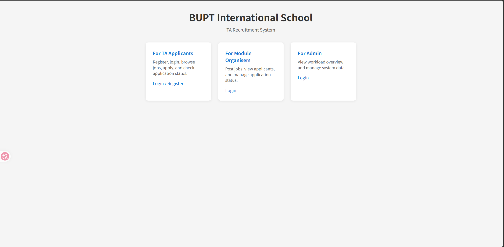

# EBU6304 Group Project - TA Recruitment System

## Development Environment Setup Guide

This project is implemented as a lightweight Java Servlet/JSP Web application.
The recommended local development environment is based on VS Code, JDK 17, Apache Maven, Apache Tomcat 10.1, and Git for Windows. This setup is sufficient for developing, running, and testing the project locally. VS Code’s Java Web guidance explicitly treats JDK, Maven, and Java extensions as the key prerequisites for this workflow.

Please note that this project uses Tomcat 10.1. Because Tomcat 10.1 is on the Jakarta EE 10 line, all Servlet-related imports in the project should use the `jakarta.servlet` namespace rather than the older `javax.servlet` namespace.

## Installation Order


### 项目结构概览（当前文件 / 文件夹）

```
ta-webapp/
├── pom.xml
├── src/main/java/edu/bupt/ta/
│   ├── controller/
│   │   ├── HomeServlet.java      （已实现）
│   │   ├── LoginServlet.java    （预留）
│   │   └── JobListServlet.java  （预留）
│   ├── service/
│   │   └── JobService.java      （预留）
│   ├── storage/
│   │   └── FileStorageUtil.java （预留）
│   └── model/
│       ├── User.java            （预留）
│       ├── Job.java             （预留）
│       └── Application.java     （预留）
├── src/main/webapp/
│   ├── index.jsp
│   ├── ta/                       （预留目录）
│   ├── mo/                       （预留目录）
│   └── admin/                    （预留目录）
│   └── WEB-INF/
│       └── web.xml
├── data/
│   ├── ta_users.csv
│   ├── jobs.csv
│   └── applications.csv
├── docs/
│   ├── project-plan.md
│   ├── requirements.md
│   └── architecture.md
└── target/                       （构建输出，不提交 Git）
```

- **`pom.xml`**  
  Maven 构建配置，定义项目名称、打包方式（`war`）、Java 17、Jakarta Servlet 依赖等。

- **`src/main/java/edu/bupt/ta/`**  
  Java 源码，按 MVC 分层：
  - `controller/`：Servlet 控制器，接收请求、调用 Service、转发 JSP；
  - `service/`：业务逻辑；
  - `storage/`：文件读写；
  - `model/`：实体类。

- **`src/main/webapp/`**  
  Web 根目录：`index.jsp` 为首页，`ta/`、`mo/`、`admin/` 分别预留 TA、MO、Admin 相关页面，`WEB-INF/web.xml` 为部署描述。

- **`data/`**  
  文本数据目录，存放 `ta_users.csv`、`jobs.csv`、`applications.csv`，供业务代码读写。

- **`docs/`**  
  项目文档：`project-plan.md`、`requirements.md`、`architecture.md`。

- **`target/`**（不提交）  
  Maven 构建输出，含 `ta-webapp.war`，本地重新生成即可。


To avoid configuration problems, install the required tools in the following order:

1. JDK 17
2. VS Code
3. VS Code Java extensions
4. Apache Maven
5. Apache Tomcat 10.1
6. Git for Windows

This order matters because the Java extensions, Maven, and Tomcat all rely on Java being installed first. VS Code’s official Java Web workflow also assumes that Java and Maven are already available before building the web application.

## Step 1: Install JDK 17

Download JDK 17 for Windows x64. Java 17 is a long-term support release and is suitable for this project environment.

A recommended installation path is: C:\Java\jdk-17

After installation, open Command Prompt and run the Java version check commands to confirm that both the Java runtime and compiler are using version 17. If both commands show version 17.x, then the installation is successful.


If you previously installed JDK 21, make sure your environment variables are updated so that the default Java points to JDK 17 instead of JDK 21. In practice, this means setting `JAVA_HOME` to the JDK 17 directory and ensuring that the `Path` variable points to the JDK 17 `bin` directory before any JDK 21 paths.

## Step 2: Install VS Code

Download the Windows User Installer x64 version of VS Code. The User Installer is the recommended option on Windows because it is simple to install and does not require administrator privileges in most cases.

Install VS Code with the default settings. After installation, open it once to make sure it starts correctly.

## Step 3: Install Java Extensions in VS Code

Open VS Code and go to the Extensions view.

First, install “Extension Pack for Java”. This extension pack provides the basic Java development experience, including code completion, debugging, testing, and Java project support. VS Code officially recommends this extension pack for Java development.

Second, install “Community Server Connectors”.
Do not install the old “Tomcat for Java” extension, because it has been deprecated. The recommended replacement is Community Server Connectors.

Optionally, you may also install “Maven for Java” and “Language Support for Java(TM) by Red Hat”, although most core Java capabilities are already included through the Extension Pack for Java.

## Step 4: Install Apache Maven

Download the current binary zip package of Apache Maven. Maven is strongly recommended because VS Code’s Java Web workflow uses it as the standard build and dependency management tool, and Maven 3.9.x works with JDK 17 without issue.

A recommended extraction path is: D:\tools\apache-maven-3.9.13

After extracting Maven, add its `bin` directory to the system `Path` environment variable.
The directory you should add is: D:\tools\apache-maven-3.9.13\bin

Then open a new Command Prompt window and check the Maven version. If the command shows Maven version information together with Java 17 runtime information, Maven is installed correctly.

## Step 5: Install Apache Tomcat 10.1

Download the Apache Tomcat 10.1 Core zip package. Tomcat 10.1 is the recommended server for this project because it supports the Jakarta EE 10 servlet and JSP standards used by modern Servlet/JSP web applications.

A recommended extraction path is: D:\tools\apache-tomcat-10.1

After extracting Tomcat, go into its `bin` folder and run `startup.bat`. Then open your browser and visit `http://localhost:8080`. If the Tomcat welcome page appears, the server is running correctly. Tomcat’s official documentation supports this standard local setup workflow.

Again, because Tomcat 10.1 uses Jakarta EE, the project must use `jakarta.servlet.*` and `jakarta.servlet.http.*` imports rather than the older Java EE `javax.*` imports.

## Step 6: Install Git for Windows

Download and install Git for Windows x64.
Install it with the default settings unless the team has a specific reason to use a different configuration.

After installation, open Command Prompt and check the Git version. If a version number is displayed, Git is installed correctly.

## Step 7: Configure VS Code to Use JDK 17

After installing the Java extensions, VS Code usually detects installed JDK versions automatically. If it does not, open the Command Palette in VS Code and use the Java runtime configuration command to manually point VS Code to your JDK 17 installation directory. VS Code’s Java tooling supports configuring the runtime explicitly in this way.

The recommended JDK path is: C:\Java\jdk-17

This step is important, especially if your system previously used JDK 21 by default.

## Step 8: Set Up the Project Workspace

Do not create project files directly on the desktop.
Instead, create a dedicated workspace folder for the project.

A recommended path is: D:\workspace\ta-recruitment-system

Open this folder in VS Code using the normal “Open Folder” workflow. This makes project management, Maven usage, and Git version control much cleaner.

## Final Expected Local Environment

After all setup steps are complete, each team member’s machine should contain the following tools:

VS Code
JDK 17
Extension Pack for Java
Community Server Connectors
Apache Maven
Apache Tomcat 10.1
Git for Windows

This environment is sufficient for building and running a lightweight Java Servlet/JSP Web application for the group project. VS Code’s official Java Web documentation and Tomcat’s current version guidance support this toolchain.

## Verification Checklist

Each team member should verify the following before starting development:

First, Java is correctly installed and the default version is 17.
Second, Maven is correctly installed and uses Java 17.
Third, Git is correctly installed.
Fourth, Tomcat can be started locally and the Tomcat welcome page opens at `http://localhost:8080`.
Fifth, VS Code can detect JDK 17 and the Java extensions are active.

If all of these checks pass, the environment setup is complete.

## Important Notes for This Project

This project uses a lightweight Java Servlet/JSP architecture rather than Spring Boot or a front-end framework. The purpose is to keep the system simple, aligned with the coursework requirements, and easy for all team members to understand and maintain.

Because the project uses Tomcat 10.1, all team members must consistently use the Jakarta namespace in servlet code. Mixing `javax.servlet` and `jakarta.servlet` across different team members will cause unnecessary errors and confusion. Tomcat 10.1’s official compatibility guidance makes this distinction explicit.

The team should also ensure that everyone uses the same major versions of JDK, Maven, and Tomcat to avoid environment mismatch problems.

## Next Step

Once the environment is ready, the next step is to create the first Maven Web project in VS Code and run a minimal working example that includes an `index.jsp` page and a basic `HelloServlet`. This will confirm that the complete JDK, Maven, Tomcat, and VS Code workflow is functioning correctly. VS Code’s Java Web guidance is built around exactly this kind of project bootstrap flow.


---

### 二、文件功能说明

> **重要**：以下仅描述当前框架中**各文件夹的职责**和**预留文件的理想实现方向**。  
> **这只是一个起点骨架**，文件仅供参考，后续开发时可**自由新建、删除、调整**，以实际需求为准。

#### 2.1 文件夹职责

| 文件夹 | 职责 |
|--------|------|
| `controller/` | 处理 HTTP 请求，调用 Service，转发到 JSP 或重定向 |
| `service/` | 业务逻辑、校验、调用 Storage |
| `storage/` | 读写 `data/` 下 CSV、JSON 等文本文件 |
| `model/` | 数据模型（POJO），如 User、Job、Application |
| `webapp/ta/` | TA 申请人相关 JSP（登录、注册、岗位列表、申请、我的申请） |
| `webapp/mo/` | MO 相关 JSP（登录、发布岗位、查看申请人、管理申请） |
| `webapp/admin/` | Admin 相关 JSP（登录、工作量概览、数据管理） |

#### 2.2 已实现文件

| 文件 | 功能 |
|------|------|
| `HomeServlet.java` | 处理 `/`、`/home`，转发到 `index.jsp` |
| `index.jsp` | TA 招募系统首页，三个角色入口 |
| `web.xml` | 欢迎页、Jakarta EE 5 配置 |

#### 2.3 预留文件及理想实现方向

| 文件 | 理想实现 |
|------|----------|
| `LoginServlet.java` | TA / MO / Admin 登录：展示登录表单，校验凭证，写入 session，按角色跳转 |
| `JobListServlet.java` | 岗位列表：调用 `JobService.getOpenJobs()`，将列表放入 request，转发到 `jobs.jsp` |
| `JobService.java` | 岗位业务：`getOpenJobs()`、`getById()`、`createJob()`、`updateJob()` |
| `FileStorageUtil.java` | 文件读写：`loadJobs()`、`saveJobs()`、`loadUsers()`、`saveUsers()`、`loadApplications()`、`saveApplications()`，处理缺失/错误文件 |
| `User.java` | 用户实体：id, name, email, role, year, major, status 等 |
| `Job.java` | 岗位实体：jobId, title, moduleCode, organiser, minYear, maxYear, hours, status 等 |
| `Application.java` | 申请实体：applicationId, userId, jobId, status, submittedAt, notes 等 |
| `ta/`、`mo/`、`admin/` | 按角色存放 JSP（如 `login.jsp`、`jobs.jsp`、`register.jsp` 等） |

后续实现时，可在此框架基础上**增删改任意文件**，无需拘泥于当前占位结构。

---

### 三、运行指令详解与 Git 版本控制说明

#### 3.1 Maven 运行指令说明

**（1）打包构建**

在项目根目录 `ta-webapp/` 下执行：

```powershell
mvn clean package
```

- 成功时输出 `BUILD SUCCESS`，在 `target/` 下生成 **`ta-webapp.war`**。
- 若失败，请检查：JDK 是否为 17、Maven 是否在 PATH、网络是否可访问 Maven 中央仓库。

**（2）部署到 Tomcat**

1. 找到 Tomcat 的 `webapps` 目录（如 `D:\apache-tomcat-10.1.52\webapps`）。
2. 将生成的 war 拷贝到该目录：

```powershell
copy target\ta-webapp.war "D:\apache-tomcat-10.1.52\webapps\"
```

（请将路径替换为你本机的 Tomcat 安装目录。）

3. 若 Tomcat 已启动，会自动解压并部署；若未启动，先执行：

```powershell
cd D:\apache-tomcat-10.1.52\bin
.\startup.bat
```

**（3）访问应用**

在浏览器中打开：

- 首页：`http://localhost:8080/ta-webapp/`
- 或：`http://localhost:8080/ta-webapp/home`

**（4）运行结果示例**

成功部署后，首页将显示 TA 招募系统入口（三个角色卡片：TA Applicants、Module Organisers、Admin）。可将运行结果截图放入 `docs/screenshots/` 目录，便于在 README 中展示。



**（5）日常开发流程（修改后本地验证）**

每次修改代码并要在浏览器中检查效果时，按以下顺序操作：

1. **Revise**：在本地修改 JSP / Servlet / Java 等代码并保存。  
2. **Build**：在项目根目录执行 `mvn clean package`，确保编译通过。  
3. **Copy**：将 `target/ta-webapp.war` 拷贝到 Tomcat 的 `webapps/` 目录（新 war 会覆盖旧部署）。  
4. **Run**：若 Tomcat 未启动则执行 `startup.bat`；若已启动，Tomcat 通常会检测到新 war 并自动重新加载应用。  
5. **Check**：在浏览器访问 `http://localhost:8080/ta-webapp/`，刷新页面查看效果。

即：**Revise → mvn clean package → copy → run → check in browser**。

---

#### 3.2 Git 版本控制说明（成员分支）

本项目采用 **成员分支** 方式：每人一个长期分支，组长分配任务，成员在自己分支上开发，自测通过后提 PR，组长 Review 后合并到 `master`。这样既满足课程“每人有可见分支与提交”的要求，又便于区分责任和合并。

**原则**

- **`master`**：仅存放稳定、可演示的版本；所有人不直接在 `master` 上提交，只通过 PR 合并。
- **成员分支**：每人一条，如 `zhangsan`、`lisi`、`member-a`（由组长与组内约定命名）。任务由组长指定，成员只改分配给自己的部分，提交并 push 到自己的分支，再提 PR 到 `master`。

---

**步骤一：组长初始化成员分支（仅一次）**

组长在本地为每位成员创建分支并推送到远程，后续成员即可在 GitHub 上看到自己的分支：

```powershell
git checkout master
git pull origin master

git checkout -b zhangsan
git push -u origin zhangsan

git checkout master
git checkout -b lisi
git push -u origin lisi

# 其他成员同理，再切回 master
git checkout master
```

（将 `zhangsan`、`lisi` 替换为实际成员分支名。）

---

**步骤二：成员日常开发并提交到自己的分支**

1. **与 master 同步后切到自己的分支**

```powershell
git checkout master
git pull origin master
git checkout zhangsan
```

2. **（可选）若自己分支已存在且一段时间没更新，先合并最新 master**

```powershell
git merge master
```

3. **修改代码**，按 **3.1（5）** 在本地执行：`mvn clean package` → 拷贝 war 到 Tomcat → 浏览器检查。

4. **提交并推送到自己的分支**

```powershell
git add .
git commit -m "feat: add TA login page"
git push -u origin zhangsan
```

（首次 push 用 `-u origin zhangsan`，之后可只写 `git push`。）

5. **在 GitHub 上发起 Pull Request**：从 `zhangsan`（或当前成员分支）指向 `master`，填写标题和说明，提交 PR。

---

**步骤三：组长 Review 并合并到 master**

1. 在 GitHub 仓库打开 **Pull requests**，找到该成员提交的 PR。  
2. 查看 **Files changed**，确认修改内容与任务一致、无多余改动。  
3. 若需要本地验证：在本地 `git fetch origin zhangsan`，`git checkout zhangsan`，再 `mvn clean package` 部署到 Tomcat 检查。  
4. 确认无误后点击 **Merge pull request**，合并到 `master`。  
5. 合并后可在 PR 页面删除该分支（可选），或保留成员分支供后续继续开发。

---

**步骤四：其他人拉取最新 master**

合并后其他成员应尽快把最新 `master` 拉到自己本地，再在自己分支上合并一次 master，避免落后太多：

```powershell
git checkout master
git pull origin master
git checkout zhangsan
git merge master
```

---

**两人同时开发、分别提交后如何合并到 master**

- **情况**：成员 A 和成员 B 同时从 `master` 拉出自己的分支（如 `member-a`、`member-b`），各自开发、各自 push 到自己的分支，并分别提 PR 到 `master`。

- **合并顺序**：先合并谁的 PR 都可以。例如先合并 A 的 PR，`master` 已包含 A 的改动；再合并 B 的 PR 时，Git 会把 B 的改动**叠加**到当前 `master` 上。只要 A 和 B **没有改同一文件的同一行**，第二个 PR 通常可以直接点击 Merge，无需额外操作。

- **若出现冲突**（两人改了同一文件同一段代码）：  
  - GitHub 会在第二个 PR 页面上提示 “This branch has conflicts that must be resolved”。  
  - 由**该分支的成员**（或组长）在本地处理冲突：  
    1. `git checkout master` → `git pull origin master`  
    2. `git checkout member-b` → `git merge master`  
    3. 根据提示打开冲突文件，保留或合并两边的修改，删除冲突标记 `<<<<<<<`、`=======`、`>>>>>>>`  
    4. `git add .` → `git commit -m "chore: resolve merge conflict with master"`  
    5. `git push origin member-b`  
  - 推送后 PR 会自动更新，冲突消失，组长再点击 Merge 即可。

- **建议**：组长在分配任务时尽量让不同成员负责不同文件或不同模块，减少冲突；合并时按 PR 提交顺序逐个合并，遇到冲突按上面步骤在对应成员分支上解决后再合并。

更细的约定（分支命名、Commit 信息格式）可写在 `docs/project-plan.md` 中统一维护。

---
